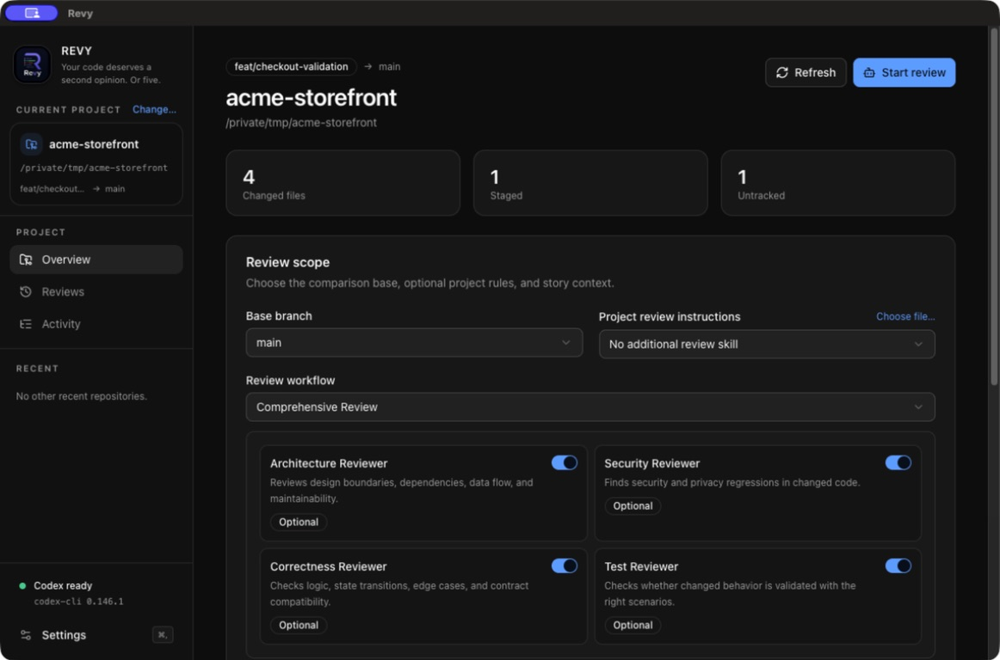
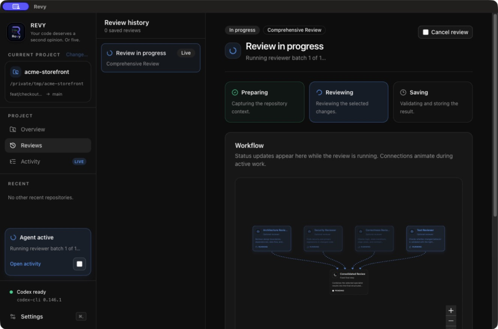
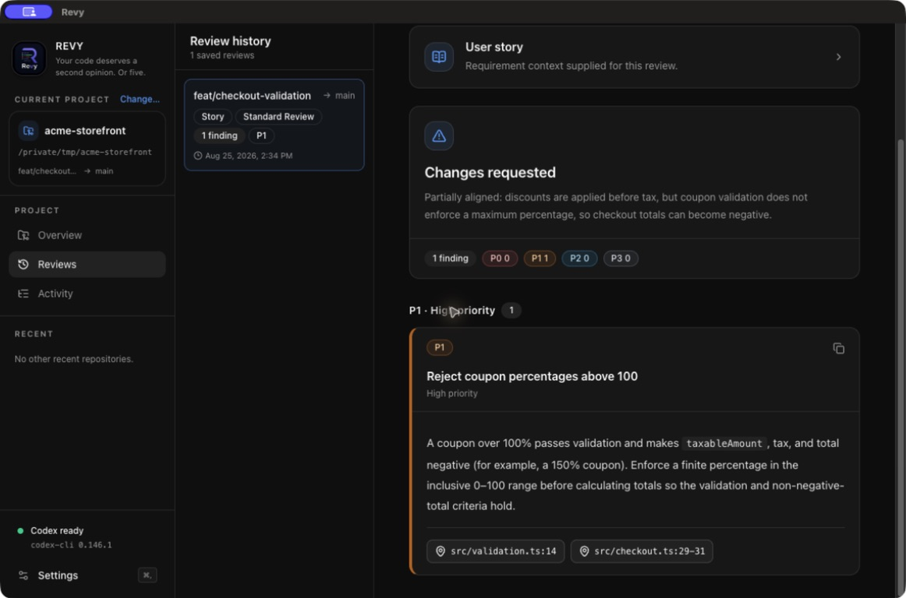
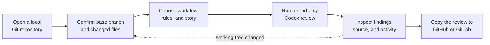

# Revy

> Your code deserves a second opinion. Or five.

Revy is a local desktop application for reviewing every change on the current Git branch before it
ships. It combines committed branch changes with staged, unstaged, and untracked work, then uses an
existing local Codex installation to turn that complete scope into a focused, structured review.

The result is a repeatable pre-ship checkpoint: choose the repository, decide what kind of review
the change needs, follow the reviewers live, and keep an immutable result that is ready to discuss
or copy into GitHub and GitLab.

## See Revy in action

### Shape the review

Confirm the complete local change scope and choose the reviewer perspectives that fit the work.



### Follow every reviewer

Watch specialist reviewers run independently before Revy consolidates their results.



### Inspect structured findings

Work through prioritized findings with concise explanations and clickable code locations.



## Why Revy?

Code review often starts too late. A pull request may be open already, local changes may still be
missing from the diff, and a single broad prompt can overlook the one risk that matters. Revy moves
that feedback loop onto the developer's machine and makes its scope visible before anything is
published.

It is built around four ideas:

- **Review the real working state.** Branch commits, the index, the working tree, and untracked
  files belong to one review scope.
- **Use the right perspectives.** Run one general review or combine focused architecture, security,
  correctness, test, and custom reviewers.
- **Keep the developer in control.** Revy inspects and reports; it does not modify the selected
  repository.
- **Make results durable.** Structured findings, per-step evidence, workflow coverage, user-story
  context, and a safe activity trail remain available after restart.

## From branch to review



1. **Open a repository.** Revy resolves the canonical Git root, detects a likely base branch, and
   remembers the repository for later.
2. **Confirm the scope.** The overview shows every changed file and whether it comes from committed,
   staged, unstaged, or untracked work.
3. **Shape the review.** Select Standard Review, a built-in or custom workflow, optional project
   instructions, and one-run user-story context.
4. **Follow the run.** A live workflow map and shared step inspector show validated reviewer
   results, readable reasoning summaries, scoped activity, consolidation, and saving. One run can
   be cancelled at any time.
5. **Work with the result.** Review P0–P3 findings, open bounded source previews, see partial coverage
   or stale-scope warnings, and copy the complete review or a single finding.

## Review workflows

Revy separates the *review workflow* from the *repository scope*. The same changes can therefore be
checked quickly for everyday work or examined from several independent perspectives before a
high-risk release.

| Workflow | Execution | Best fit |
| --- | --- | --- |
| **Standard Review** | One Codex review with the global model, reasoning, project rules, story, and personal style | Fast, broad feedback for normal changes |
| **Comprehensive Review** | Architecture, Security, Correctness, and Test reviewers run independently, then a coordinator consolidates their structured results | Cross-cutting or release-critical changes |
| **Custom workflow** | Any saved combination of required and optional custom or built-in reviewers, with per-reviewer model and reasoning overrides | Team conventions, domain checks, or recurring risk profiles |

Required reviewers must finish successfully. An optional reviewer may be disabled for one run; if a
selected optional reviewer fails, Revy can still save a result with an explicit partial-coverage
warning. Larger workflows run in batches of up to four reviewers.

Review Setup keeps built-ins immutable. Duplicate a preset or workflow to customize it, or create a
new reviewer and assemble a reusable workflow. The resolved plan is snapshotted when a run starts,
so later configuration edits cannot rewrite historical coverage.

## What is included

- Native repository selection, canonical Git-root detection, recent repositories, and selectable
  base branches.
- Read-only change discovery through the system Git installation.
- One cancellable Codex review at a time, using models and reasoning efforts discovered from Codex
  App Server.
- Built-in reviewer presets, reusable custom reviewers and workflows, per-run optional reviewers,
  and consolidated multi-reviewer results.
- Optional user-story context with explicit requirement and acceptance-criteria checks.
- Immutable structured review history with P0–P3 findings, summaries, workflow coverage, and legacy
  Markdown support.
- A shared workflow-step inspector with validated results, readable reasoning summaries, and
  reviewer-scoped activity for live and historical runs.
- Live and persistent activity for completed, failed, cancelled, and interrupted review runs.
- Clickable code locations, validated HTTPS references, and copy actions for a complete review or
  one finding.
- Global model, reasoning, personal-style, and diagnostics settings plus repository-specific base,
  workflow, and review-instruction preferences.

## Local by design

Repositories are treated as read-only. Git, filesystem, persistence, and Codex subprocess access
stay in Electron's main process and are exposed to the interface through a narrow, validated API.
Revy writes reviews and settings to Electron's platform-specific application-data directory—not to
the selected repository—and keeps rotating technical logs in Electron's logs directory.

Step evidence may contain validated structured results and readable model-generated reasoning
summaries. Revy still discards prompts, user stories, raw reasoning, tool arguments, tool results,
command output, and repository contents; diagnostics contain neither step results nor reasoning
summaries. Revy does not upload its application data or logs.

See [Architecture](docs/architecture.md) for the full app flow, workflow execution model, technology
map, security boundary, and file-by-file storage layout.

## Requirements

- Node.js 22.12 or newer
- pnpm 11.15.1 through Corepack
- Git available on `PATH`
- an installed and authenticated Codex CLI (`codex login`)

Codex App Server is an experimental external dependency. Revy does not install, update,
authenticate, or modify the configuration of Codex. See the
[official App Server documentation](https://learn.chatgpt.com/docs/app-server).

## Development

```sh
pnpm install
pnpm dev
```

Open a repository, confirm its detected base branch, optionally select a workflow, project review
instructions, or a user story, and start the review. The completed result and the activity of every
attempt remain available after restart.

| Command | Purpose |
| --- | --- |
| `pnpm dev` | Start the Electron app in development mode |
| `pnpm build` | Type-check and build the desktop app |
| `pnpm start` | Preview the production build |
| `pnpm check` | Run Biome and TypeScript checks |
| `pnpm check:fix` | Apply safe Biome fixes and run TypeScript checks |

Automated tests are intentionally not part of this project.

## Workspace

```text
apps/desktop              Electron application and app-local contracts
packages/typescript-config
packages/ui               Shared React components, styles, and shadcn source
```

External versions are exact and centralized in the pnpm catalog. Shared UI components are added
through the desktop shadcn entrypoint:

```sh
pnpm --filter @revy/desktop exec shadcn add <component>
```

The checked-in Codex protocol bindings reflect the development CLI version. Regenerate them after
an intentional Codex protocol update:

```sh
cd apps/desktop
codex app-server generate-ts --experimental --out ./src/generated/codex-app-server
```

## License

Revy is available under the [MIT License](LICENSE).
