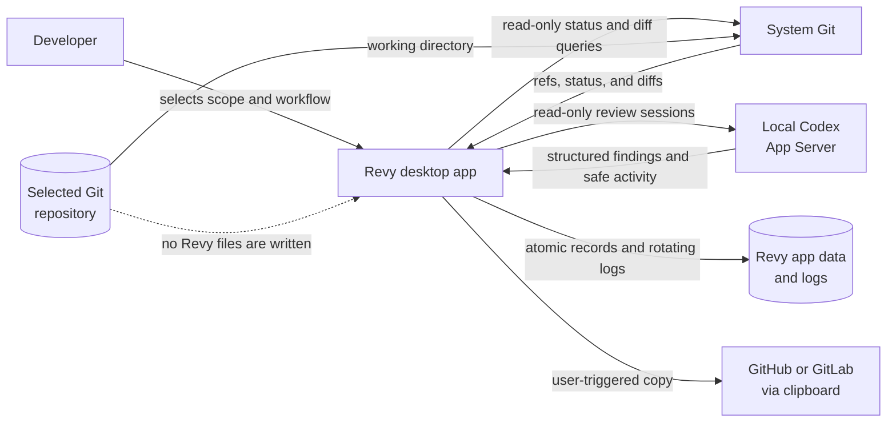
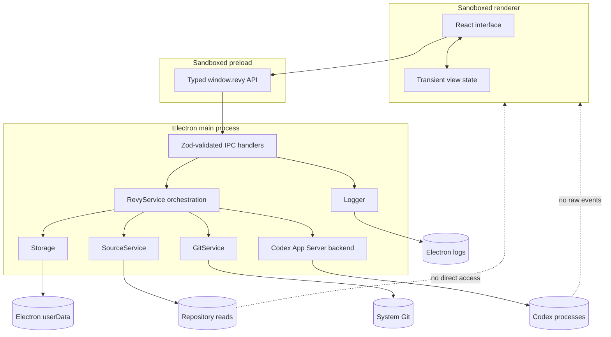
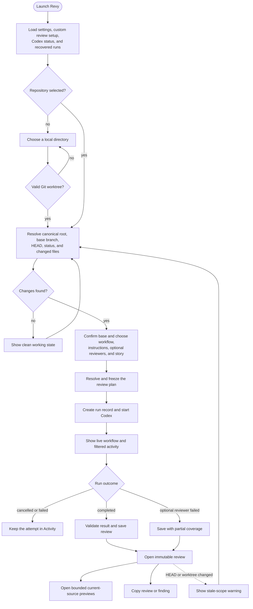
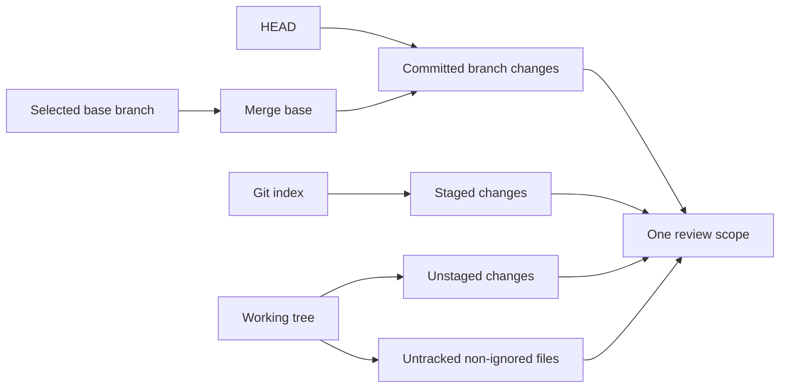
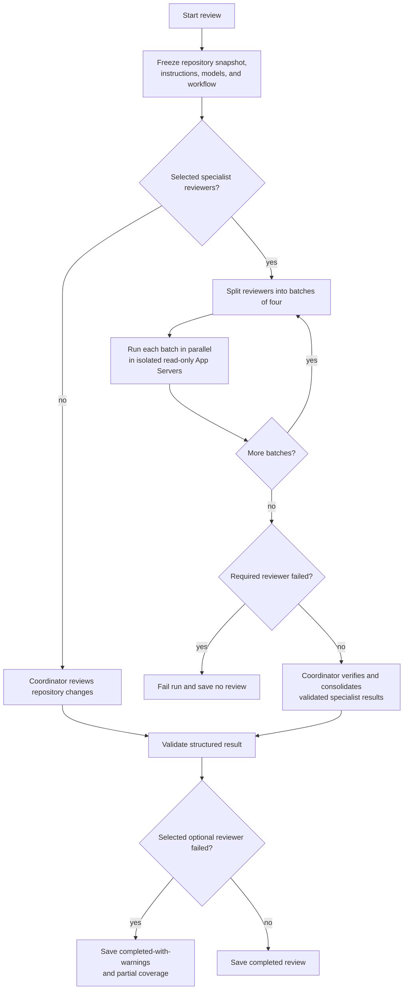
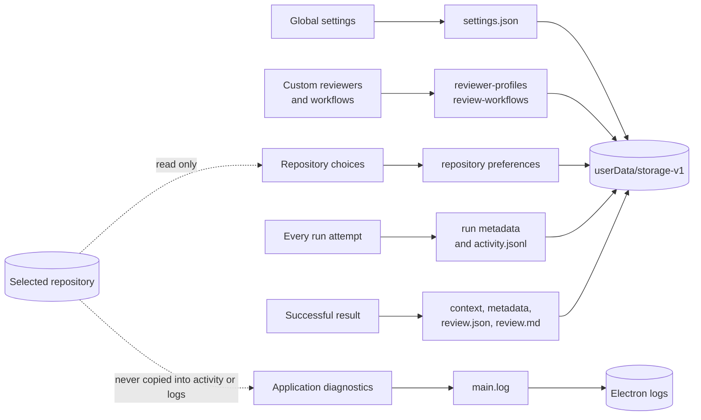
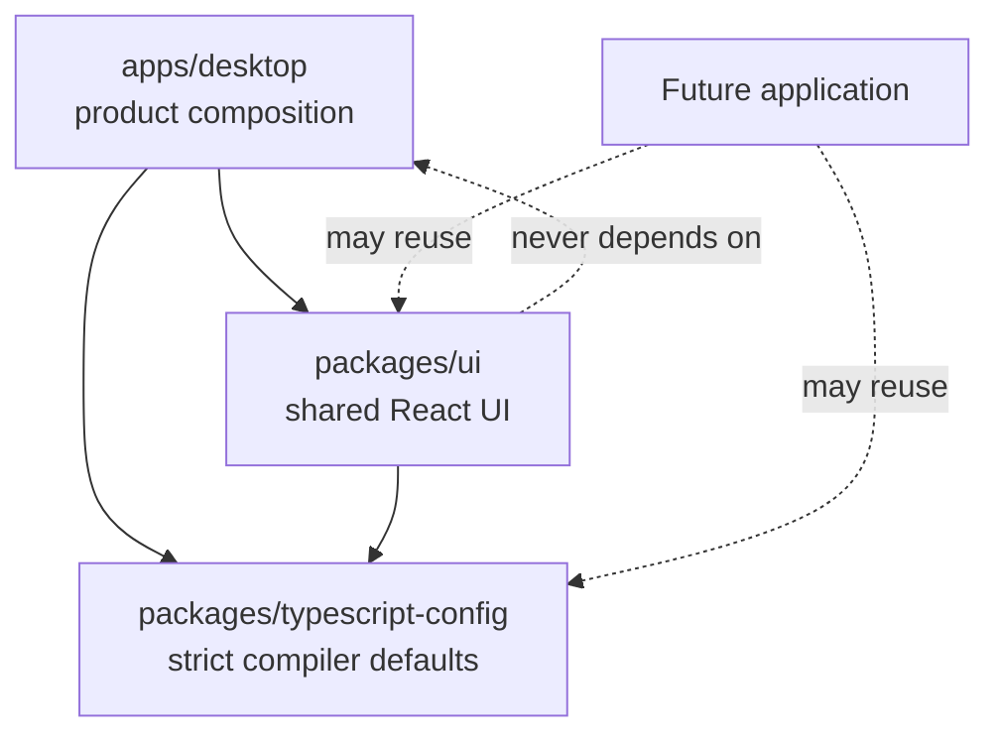

# Architecture

Revy is a local, read-only Electron application in a pnpm workspace. It turns the complete change
set of one Git repository into a structured Codex review while keeping repository access,
subprocesses, persistence, and operating-system capabilities outside the browser-based interface.

This document is the canonical overview of Revy's product flow, runtime boundaries, review
execution, storage, and package responsibilities. The [README](../README.md) remains the concise
product introduction and development entry point.

## Design goals

Revy exists to make review a deliberate local step before changes are published. That motivation
produces a few architectural constraints:

- **Complete scope:** committed branch changes and local worktree changes are reviewed together.
- **Read-only operation:** Revy may inspect Git and repository files but does not apply fixes or
  write configuration into the selected repository.
- **Visible orchestration:** the chosen reviewers, execution state, partial coverage, and final
  consolidation remain understandable to the user.
- **Local ownership:** review records, preferences, activity, and diagnostics stay in
  platform-specific Revy directories.
- **Defence in depth:** the renderer never receives arbitrary filesystem, Git, subprocess, or
  navigation capabilities.
- **Durable evidence:** every attempt has an activity record; every successful result snapshots the
  repository fingerprint and exact review plan used at that time.

## System at a glance



Revy is not a Git client, hosted review service, or autonomous repair agent. The user owns the
repository and decides what to do with every finding.

## Technology map

| Area | Technology | Responsibility in Revy |
| --- | --- | --- |
| Desktop runtime | Electron | Native windows and dialogs, process isolation, application paths, clipboard, and safe external links |
| Application code | TypeScript with strict settings | Shared contracts and process-specific implementation |
| Interface | React | Overview, live workflow, review history, activity, source preview, and settings |
| Styling and components | Tailwind CSS, shadcn, and Radix UI | Themeable, accessible product UI and reusable primitives |
| Workflow visualization | `@xyflow/react` | Fixed reviewer maps, batching, live states, pan, zoom, and fit controls |
| Runtime validation | Zod | IPC inputs, persisted records, generated-protocol projections, and structured findings |
| Git inspection | `simple-git` plus system Git | Canonical roots, refs, merge bases, status, and changed-file discovery |
| Review backend | Codex App Server over JSONL stdio | Model discovery and read-only single- or multi-reviewer runs |
| Persistence | JSON, JSONL, and Markdown files | Atomic configuration and review records plus append-only activity |
| Diagnostics | `electron-log` | Scoped local logging with bounded rotation and a privacy filter |
| Build and workspace | pnpm, electron-vite, Vite, and Biome | Strict dependency catalog, desktop builds, type checking, formatting, and linting |

There is intentionally no database or remote Revy service. The file formats are inspectable,
versioned through their schemas, and sufficient for the current single-user desktop product.

## Runtime boundaries



Only product-shaped data crosses `window.revy`. The preload exposes named operations such as
selecting a repository, updating preferences, starting a review, reading a bounded source preview,
and copying validated text. It does not expose Electron, Node.js, a generic command runner, or a
generic filesystem API.

### Desktop ownership

`apps/desktop` owns the complete local product:

- `src/main/index.ts` creates the window, blocks navigation and popups, registers the narrow IPC
  surface, opens native file pickers, and publishes high-level review progress.
- `src/main/app-service.ts` resolves immutable review plans and coordinates the active repository,
  settings, reviews, and the single active run.
- `src/main/git-service.ts` uses `simple-git` with main-process-owned argument arrays to resolve Git
  roots, refs, merge bases, and status. It never accepts a command from the renderer.
- `src/main/codex-app-server.ts` implements the desktop-local `ReviewBackend`, owns the coordinator
  App Server and bounded reviewer App Servers, and projects the required protocol events into safe
  activity.
- `src/main/storage.ts` owns atomic settings, repository preferences, recents, reviews, and
  append-only run activity.
- `src/main/logger.ts` owns scoped, rotating, local-only diagnostics and their privacy boundary.
- `src/main/source-service.ts` resolves code references and project instruction files inside the
  canonical repository root.
- `src/shared/contracts.ts` is the app-local Zod source of truth for IPC inputs, persisted records,
  and renderer-facing types.
- `src/shared/review-presets.ts` owns the virtual built-in reviewer and workflow catalog. Built-ins
  are merged with persisted custom configuration at the service boundary and never seeded to disk.
- `src/shared/review-formats.ts` validates structured agent output, derives review status and
  priority, and generates portable Markdown without platform-specific links.
- `src/generated/codex-app-server` contains version-specific TypeScript bindings produced by Codex.
  Zod still validates incoming JSON because generated TypeScript types provide no runtime boundary.
- `src/preload/index.ts` exposes only repository, settings, review, activity, diagnostics,
  source-preview, bounded clipboard, and validated external-link operations.
- `src/renderer` owns browser-safe composition, structured review cards, safe Markdown rendering,
  and the app-local workflow projection.

The generated bindings use bundler module resolution because Codex emits extensionless TypeScript
imports. They are excluded from Biome formatting and linting; all maintained source remains under
the normal Biome rules.

## App flow

The main interface has four stable areas:

| Surface | What the user does there | Data source |
| --- | --- | --- |
| **Overview** | Opens a repository, confirms scope, chooses a base, workflow, project instructions, optional reviewers, and user story, then starts the review | Fresh Git snapshot plus repository preferences |
| **Reviews** | Follows the active workflow or reads immutable results, source locations, coverage, and story context | Saved reviews plus transient live progress |
| **Activity** | Inspects every run attempt, including failed, cancelled, and interrupted runs | Run metadata plus privacy-filtered JSONL activity |
| **Settings** | Selects Codex, model, reasoning, personal style, diagnostics, reviewer profiles, and workflows | Global settings plus custom configuration records |



Startup recovery converts unfinished run records into `interrupted` activity. Starting a new run
opens the review page immediately; the saved result replaces that transient progress view only
after output validation and persistence succeed.

## Repository and review scope

A repository selection is canonicalized to its real Git root. Bare and non-Git directories are
rejected. Base detection follows this order:

1. `origin/HEAD`
2. `main` or `origin/main`
3. `master` or `origin/master`
4. the first available ref as a final local fallback

The displayed review scope is the union of:

- committed changes from the selected base's merge base to `HEAD`;
- staged changes;
- unstaged changes; and
- untracked, non-ignored files.



The repository fingerprint hashes `HEAD` and porcelain-v2 worktree status. Review metadata retains
that fingerprint so history can report when either the branch or worktree has changed. Historical
findings remain immutable, while a source preview deliberately reads the current working-tree file
and displays a warning when the fingerprint is stale.

## Review workflows

### Workflow types

| Type | Stored selection | Reviewers | Result path |
| --- | --- | --- | --- |
| **Standard Review** | `workflowId: null` | No specialist profile; one coordinator review | Codex result is validated and saved directly |
| **Comprehensive Review** | Stable virtual built-in ID | Architecture, Security, Correctness, and Test; all optional and enabled by default | Independent results are consolidated by a final coordinator |
| **Custom workflow** | Persisted custom workflow ID | Required and optional assignments from custom or built-in profiles | Selected specialists run first, then the coordinator consolidates |

Standard Review preserves the direct single-agent path. Comprehensive Review and custom workflows
make reviewer perspectives explicit without allowing them to coordinate among themselves.

### Execution model



Every selected specialist runs in its own ephemeral App Server thread rooted at the repository with
`read-only` sandboxing and no approvals or further delegation. Revy runs at most four specialists
concurrently and uses sequential batches for larger workflows. A specialist may override the
global model and reasoning effort through its resolved profile.

The final coordinator owns the global model, reasoning effort, project rules, optional user story,
and personal style. For workflow runs it receives only validated structured specialist results,
treats them as untrusted evidence, verifies them against the repository, and produces the normal
`structured-v1` review. Reviewer prompts and raw responses are never added to activity or
diagnostics.

The bound Codex version discovers custom agent files only in personal or project-scoped Codex
directories. Revy intentionally writes to neither location. The backend therefore uses app-owned
independent App Server threads instead of mutating `~/.codex` or the selected repository. Parent
cancellation interrupts all known active reviewer turns; app shutdown stops every owned App Server
process.

### Immutable plans and configuration

A configured workflow resolves profile references, required reviewers, selected optional
reviewers, models, and reasoning efforts into an immutable plan before Codex starts. Disabled
optional profiles are not validated against the current model catalog and remain `not-selected`.
The plan snapshot is kept with run and review metadata, including reviewer outcomes, so history
does not change when a profile or workflow is edited later.

Built-in profiles and workflows are virtual and read-only. The Review Setup interface duplicates a
built-in into a new custom draft before it can be edited. Custom reviewer and workflow IDs become
saved UI state only after the validated IPC write succeeds. Dirty drafts survive reviewer detail
navigation and guard workflow changes or Settings dismissal.

Repository preferences select a workflow, but optional reviewers are chosen for each individual
run. Required assignments cannot be switched off. Deleting a referenced custom profile is rejected;
deleting a custom workflow resets affected repositories to Standard Review.

### Instruction order and story context

The custom review instruction order is fixed:

1. non-overridable read-only, scope, structured JSON, priority, and reference contracts;
2. optional user-story context, explicitly isolated as untrusted requirement data;
3. the selected repository review-instruction file, if any;
4. personal style instructions.

The user story applies to one run. Codex must assess the story and its acceptance criteria in the
summary and report concrete unmet requirements through the normal finding model. Ambiguous or
unassessable requirements stay in the summary rather than becoming invented findings. Story
context is saved only with a successful review, not in activity.

### Result and failure semantics

Every attempt creates a repository-scoped run record before Codex starts. The UI receives curated
lifecycle, command, tool, search, subagent, and warning metadata while prompts, reasoning, tool
arguments, patches, and command output stay out of activity. Started and completed updates for one
action resolve to one timeline entry.

- A required reviewer failure ends the run as `failed`; no review is saved.
- A selected optional reviewer failure still allows consolidation and stores
  `completed-with-warnings` with partial coverage.
- A disabled optional reviewer creates neither work nor a warning.
- Cancellation keeps the run record and interrupts owned reviewer turns.
- App shutdown recovery marks unfinished attempts as `interrupted`.
- A structured-output parse or schema failure ends the run without creating a review.

The main process accepts `exitedReviewMode` text only when it contains a valid versioned review
object. A single outer JSON fence is tolerated. Valid findings require a P0–P3 priority, concise
Markdown body, and at least one repository-relative code location. The structured record is
authoritative; Revy derives portable Markdown for GitHub and GitLab copy actions. Deleting a
completed run or review removes both linked records, while unsuccessful runs have activity only.

Codex App Server is experimental and external. Revy feature-probes initialization, account, and
model discovery, validates the consumed event subset, and reports incompatible methods or
payloads. It does not automatically restart a crashed server; a later explicit retry may start a
new process.

## Persistence and storage

### Physical locations

Revy asks Electron for platform-correct directories instead of constructing operating-system paths
itself:

| Content | Runtime root | Revy location |
| --- | --- | --- |
| Settings, custom review setup, repository preferences, runs, and reviews | `app.getPath('userData')` | `<userData>/storage-v1/` |
| Rotating technical diagnostics | `app.getPath('logs')` | `<logs>/main.log` and one rotated archive |
| Selected repository | User-selected canonical Git root | Read on demand; Revy writes nothing here |
| Codex configuration and authentication | Owned by the installed Codex CLI | Read or used by Codex; Revy does not modify it |

The exact absolute roots vary by operating system and user configuration. On macOS they are
typically below `~/Library/Application Support/Revy` and `~/Library/Logs/Revy`; using Electron's
resolved paths remains the source of truth.

### Data placement



All durable product writes stay under Electron `userData/storage-v1`:

```text
settings.json
reviewer-profiles/<uuid>.json
review-workflows/<uuid>.json
repositories/<sha256-of-canonical-root>/
├── repository.json
├── preferences.json
├── reviews/<uuid>/
│   ├── context.json
│   ├── metadata.json
│   ├── review.json
│   └── review.md
└── runs/<uuid>/
    ├── metadata.json
    └── activity.jsonl
```

| Record | Contents | Write strategy |
| --- | --- | --- |
| `settings.json` | Recent repositories, optional Codex executable, global model and reasoning, personal instructions, and debug switch | Schema-validated JSON, temporary file then rename |
| `reviewer-profiles/*.json` | User-created reviewer name, description, instructions, and optional model or reasoning overrides | One atomic JSON file per stable UUID |
| `review-workflows/*.json` | User-created workflow name plus required and optional profile assignments | One atomic JSON file per stable UUID |
| `repository.json` | Canonical repository root for the hashed directory | Atomic JSON; repository contents are not copied |
| `preferences.json` | Base branch, workflow, and one repository-relative instruction file | Atomic JSON scoped to one repository |
| `runs/*/metadata.json` | Status, timestamps, fingerprint, resolved workflow snapshot, outcomes, and linked review ID | Atomic JSON updated at lifecycle boundaries |
| `runs/*/activity.jsonl` | Ordered, privacy-filtered activity entries | Created before execution and appended immediately |
| `reviews/*/context.json` | Normalized one-run user story | Atomic JSON written only for successful reviews |
| `reviews/*/metadata.json` | Branch, base, fingerprint, model, instruction sources, and final plan | Atomic JSON |
| `reviews/*/review.json` | Authoritative versioned structured result | Atomic, schema-validated JSON |
| `reviews/*/review.md` | Portable derived copy of the review | UTF-8 Markdown written beside the structured result |

Custom reviewer profiles and workflows are separate records rather than fields in the global
settings object. Their missing origin field is read as `custom` for compatibility. Built-ins remain
virtual and cannot be saved or deleted through the service. Obsolete persisted format preferences
are discarded without resetting the remaining settings. Older records without workflow data parse
as Standard Review, and a missing `context.json` is treated as empty context. Review directories
without `review.json` remain readable as legacy Markdown.

JSON records use write-then-rename replacement so readers do not observe partially written files.
Activity uses append-only JSONL so an interrupted process still leaves an inspectable timeline.
There is no database, migration runner, cloud synchronization, or repository-local Revy directory.

Workflow diagram layout, animation, batch selection, unsaved settings drafts, and transient review
progress are renderer state. They are never persisted or sent to Codex.

### Diagnostics and privacy

Diagnostics use `electron-log` in the main process. `main.log` rotates at 5 MiB to one archive;
normal logging starts at `info`, while the persisted setting enables `debug`. Debug may include
local paths and stack traces, but logs never include repository contents, prompts, reasoning, raw
App Server messages, user stories, tool arguments, or command output. Revy does not upload logs.

## Code-reference security

Structured reviews carry repository-relative path and line records. Legacy reviews may use
`revy://code/<repository-relative-path>?line=<line>&end=<line>`. The renderer converts either form
into structured arguments. The main process then:

- rejects absolute paths, traversal, invalid identifiers, and missing files;
- canonicalizes both repository and target paths;
- rejects symlinks that escape the repository;
- accepts only regular, non-binary files up to 2 MiB; and
- returns a bounded source window around the requested lines.

Historical links intentionally show the current working-tree file. The review and source panel both
warn when the saved fingerprint is stale.

## Electron security boundary

The window preserves context isolation, renderer sandboxing, disabled Node integration, a
restrictive Content Security Policy, popup denial, webview denial, and navigation blocking. Every
renderer argument is parsed through a strict Zod schema in the main process. Git, arbitrary
filesystem APIs, subprocess handles, raw App Server events, and internal reasoning are never
exposed to the renderer.

Activity IPC carries only validated Revy records. Opening the log directory is a pathless
main-process action, and renderer diagnostics accept only bounded error metadata. Clipboard writes
are bounded text operations. External references must be absolute HTTPS URLs and are opened by the
main process in the system browser; the renderer never receives general navigation capability.

Finding bodies and legacy reviews are rendered as GitHub-flavoured Markdown without raw HTML.
Repository code references are handled as in-app actions. HTTPS links use the validated
main-process operation; unsupported link schemes remain non-interactive.

## Workspace and package boundaries



`@revy/ui` owns framework-neutral React components, theme tokens, and base styles that remain usable
by a future Next.js application. `@revy/typescript-config` owns strict shared TypeScript defaults.
Applications may depend on packages; packages never depend on applications, and consumers use
declared package exports.

No provider-agnostic adapter package exists yet because Codex is the only backend. A later second
backend may justify extracting a stable adapter boundary for Claude, Hermes, or a Deep Agents and
LangSmith implementation. Packaging, signing, a web application, diff browsing, review editing,
agent fixes, concurrent reviews, CI, and automated tests remain out of scope.
